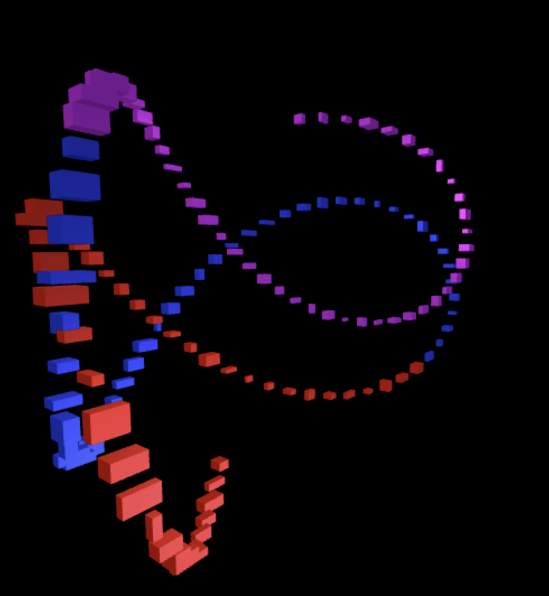
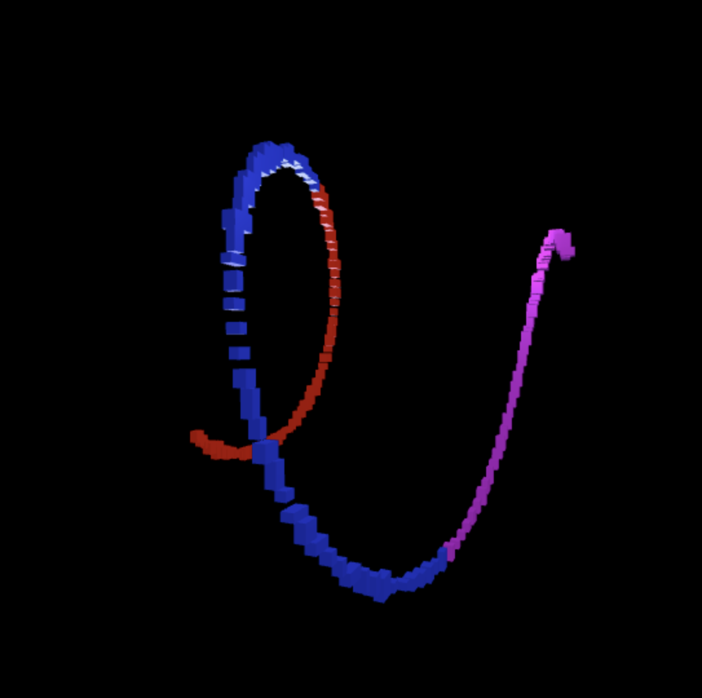

# Práctica Semana 11 IG

## Autora

María Cabrera Vérgez

## Enlaces

- [CodeSandbox](https://codesandbox.io/p/sandbox/practica-11-ccg3y9)
- [Demostración](https://drive.google.com/file/d/1kiCKy9qCldq_J-bCQohRrGs8M84_PtgT/view?usp=sharing)

## Tareas a realizar

La tarea consiste en proponer un prototipo three.js de temática libre que integre la biblioteca tween.js y/o el motor de física ammo.js. La entrega se llevará a cabo a través del campus virtual, debiendo incluir enlace githubm incluyendo una descripción en el README del trabajo realizado, así como un vídeo, preferentemente de no más de un minuto de duración, con un extracto seleccionado de la animación desarrollada y que identifique la autoría. Resolución recomendada: 1920 × 1080 (Full HD, 16:9)

## Índice de contenidos

- [Init](#init)
- [TweenModels](#tweenmodels)
- [AnimationLoop](#animationloop)
- [Resize](#resize)
- [Resultado_imágenes](#resultado_imágenes)
- [Webgrafía](#webgrafía)


## Init

En la función init(), se jugará con la luz para iluminar la diferentes figuras que se van a ir formando. Para ello, se crearán 4 luces diferentes. La primera es una luz direccional que tendrá un color azulado pálido. Se normaliza su posición y se añade a la escena.

``` javascript
    const dirLight = new THREE.DirectionalLight(0x9090aa);
    dirLight.position.set(-300, -300, -500).normalize();
    scene.add(dirLight);
```

La siguiente luz simula una luz que viene del cielo. El primer color sirve para la luz del cielo y el segundo es para la luz inferior.

``` javascript
    const light = new THREE.HemisphereLight(0xffffff, 0x444444);
    light.position.set(1, 1, 1);
    scene.add(light);
```

La tercera fuente de luz colocada emite luz desde un punto en todas las direcciones. Se le pasa una intensidad y la distancia de alcance.

```javascript
    const softLight = new THREE.PointLight(0xffffff, 0.7, 2000);
    softLight.position.set(200, 300, 200);
    scene.add(softLight);
```

La última iluminación es uniforme, sin dirección. Ilumina todas las caras por igual, reforzando las otras luces.

``` javascript
    scene.add(new THREE.AmbientLight(0x222223, 0.6));
```
A continuación, se crea un bucle que itera 135 veces (COUNT). En cada iteración, lo que se hace es crear un color y un material nuevo para guardar. Yendo paso a paso, lo primero es declarar la variable para el color. La figura se divide en 3 bloques iguales por cada índice. Cada uno recibe un color distinto con valores HSL (tono, saturación, brillo). Por último, se crea un MeshStandardMaterial y se añade dentro de materials, con el resto de materiales. A estos se les señala un color, qué tan metálico es un material y el estado de la reflexión.

``` javascript
    for(let i = 0; i < COUNT; i++){
        let color;

        if(i < COUNT/3){
            color = new THREE.Color().setHSL(0, 1, 0.5);
        } else if(i < 2*COUNT/3) {
            color = new THREE.Color().setHSL(0.66, 1, 0.5);
        } else{
            color = new THREE.Color().setHSL(0.8, 1, 0.5);
        }
        materials.push(new THREE.MeshStandardMaterial({color, roughness: 0.4, metalness: 0.6}));
    }
```
Se crea al geometría de un cubo con 20 unidades de ancho, 20 de alto y 20 de profundidad. Al igual que con el material, los cubos se crean dentro de un bucle que se itera COUNT (135) veces. Se crea el mesh usando la geometría anteriormente creada, pero usando el material correspondiente anteriormente añadido. De esta manera, el color varía entre los cubos. Se guarda el mesh y se añade cada uno a la escena. Para finalizar con la función, se realiza un resize cada vez que el usuario modifique el tamaño de la ventana.

``` javascript
    const geometry = new THREE.BoxGeometry(20, 20, 20);
    for(let i = 0; i < COUNT; i++){
        const mesh = new THREE.Mesh(geometry, materials[i]);
        models.push(mesh);
        scene.add(mesh);
    }

    window.addEventListener("resize", resize);


}
```

## TweenModels

Esta será la función más importante, puesto que es la encargada de las formas que van realizando los diferentes cubos de colores, usando TWEEN para la animación de cada uno. Cada vez que acaba, se vuelve a llamar a sí mismo para que parezca que la animación no tiene final.

Para que no se acumulen los tweens que se van creando, se eliminan al principio de la función. Se definen las diferentes variables que serán necesitadas en la función. Se tiene el tiempo, que señala la duración del tween; sx, sy, sz que se encargan de la escala; yaw, que es la rotación del eje y en grados; pitch, que es la rotación en el eje x en grados; dist, que es cuanto se aleja del origen; lookAtZero que es la probabilidad de que los puntos miren a un punto en concreto.

``` javascript
    TWEEN.removeAll();
    const time = Math.random() * 1000 + 250;
    const sx = Math.random() * 3;
    const sy = Math.random() * 3;
    const sz = Math.random() * 2;
    const yaw = Math.random() * 1000;
    const pitch = Math.random() * 1200;
    const dist = Math.random() * 500 + 250;
    const lookAtZero = Math.random() > 0.5;
```

Se itera sobre cada modelo creado, se calcula la posición que tendrá y se va generando poco a poco un patrón.

``` javascript
    for(let i = 0; i < models.length; i++){
        const model = models[i];
        const n = i / models.length - 0.5;
```

Se crean objetos objetos 3D a los que se le aplicará diversas transformaciones, como rotaciones en los 3 ejes, translación en el eje Z y se cambia su escala, teniendo un valor mínimo de 0.5.

``` javascript
        const t = new THREE.Object3D();
        t.rotateX((pitch * n *Math.PI)/180);
        t.rotateY((yaw * n *Math.PI) / 180);
        t.rotateZ((yaw*n*Math.PI)/180);
        t.translateZ(dist);
        t.scale.set(sx * Math.random() + 0.5, sy * Math.random() + 0.5, sz * Math.random() + 0.5);
```

En algunos momentos, los cubos mirarán todos al punto (1, 0, 0), dando la sensación de orden y que se sigue cierto patrón.

``` javascript
     if(lookAtZero) t.lookAt(new THREE.Vector3(1, 0, 0));
```

Se crearán 3 tweens: uno encargado de la posición, otro de la escala y un último de la rotación. El primero indicará la posición y cuanto durará la animación. Se define la curva que seguirá y lo añade a la lista activa de tweens presente. El mismo proceso se sigue en los otros dos tweens, con la única diferencia del primer valor pasado a .to(), que hace referencia al 'trabajo' del tween. Al final de la función, se ejecuta setTimeout(). Es una función que espera una serie de ms indicados (time) y ejecuta la función pasada como primer parámetro. De esta forma, tweenModels da un efecto de animación infinita.

``` javascript
        new TWEEN.Tween(model.position)
            .to(t.position, time - 100)
            .easing(TWEEN.Easing.Quadratic.InOut)
            .start();
        new TWEEN.Tween(model.scale)
            .to(t.scale, time-100)
            .easing(TWEEN.Easing.Quadratic.InOut)
            .start();
        new TWEEN.Tween(model.rotation)
            .to(t.rotation, time- 100)
            .easing(TWEEN.Easing.Quadratic.InOut)
            .start();
    }

    setTimeout(tweenModels, time);
}
```

## AnimationLoop

La función recibe un parámetro de tiempo que irá aumentando progresivamente. La animación es llamada debido a requestAnimationFrame(). La cámara se irá alejando y acercando del centro, dando cierto toque a la animación como si la persona que lo ve es quien estuviera moviéndose. Lo mismo sucede con la altura, subiendo y bajando con un movimiento vertical suave.

``` javascript
function animationLoop(time){

    requestAnimationFrame(animationLoop);

    const radius = 700 + Math.sin(time/5000)* 200;
    const height = 50 + Math.sin(time/2500) * 50;
```

Por otro lado, la cámara irá girando alrededor del centro de la figura, viendo la misma desde diferentes ángulos y viendo, así, distintas figuras a partir de una sola. La cámara siempre dirigirá su vista al centro.

``` javascript
    camera.position.set(Math.sin(time/3000)*radius, height, Math.cos(time/3000)*radius);
    camera.lookAt(new THREE.Vector3(0, 0, 0));
```

Se avanzan las animaciones de Tween.js y se dibuja la escena con la cámara dentro del canvas.

``` javascript
    TWEEN.update();
    renderer.render(scene, camera);
```

## Resize

La última función realizada sirve para adaptar los elementos, como el render o la cámara, al tamaño de la ventana o pantalla. De esta manera, coincidirá con el ancho y alto de cada momento. Una vez calculado para la cámara, se usa updateProjectionMatrix() para que la cámara recalcule la información nuevamente y se actualice.

``` javascript

function resize(){
    renderer.setSize(window.innerWidth, window.innerHeight);
    camera.aspect = window.innerWidth / window.innerHeight;
    camera.updateProjectionMatrix();
}

```

## Resultado_imágenes




## Webgrafía

- [Tween.js en Three.js](https://sbcode.net/threejs/tween/)
- [Vídeo sobre Tween.js](https://www.youtube.com/watch?v=vIbrIORmtsw)
- [Animaciones tipo yoyo en Tween.js](https://discourse.threejs.org/t/tween-js-how-to-do-a-yoyo-animation/23073)
- [HemisphereLight — Documentación oficial](https://threejs.org/docs/#HemisphereLight)


